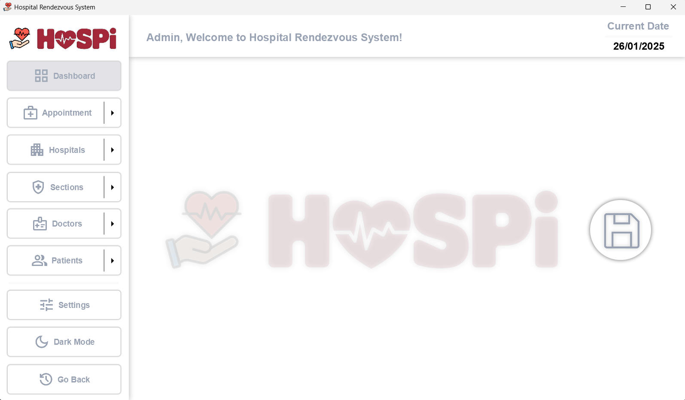
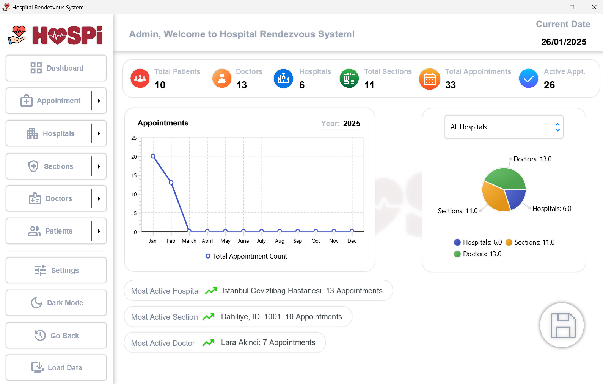
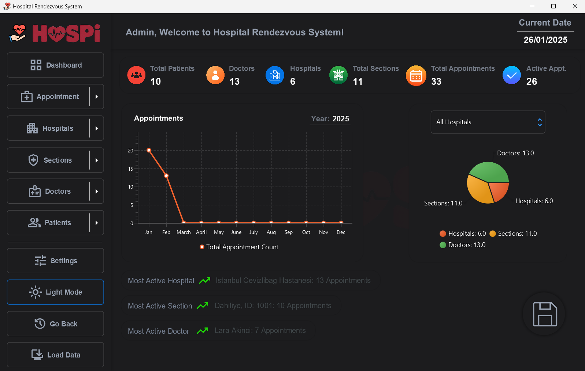
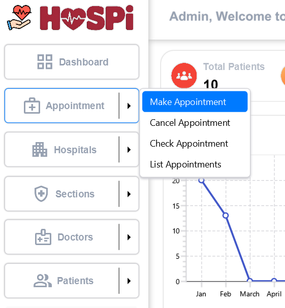
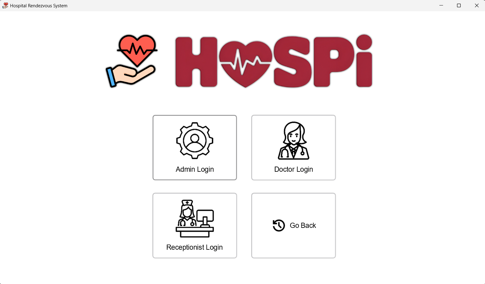
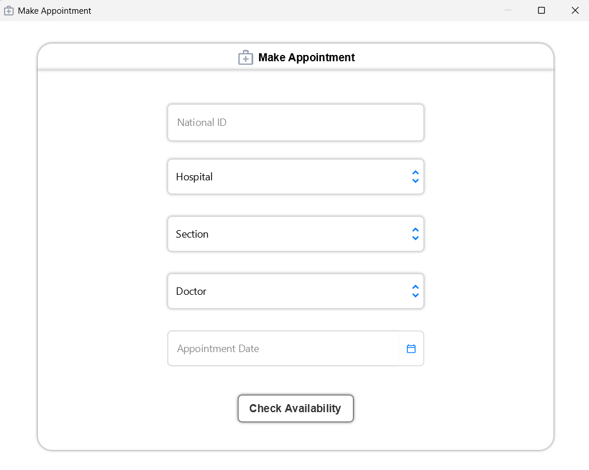

[![Contributors][contributors-shield]][contributors-url]
[![Stargazers][stars-shield]][stars-url]
[![Issues][issues-shield]][issues-url]
[![Unlicense License][license-shield]][license-url]


<!-- PROJECT LOGO -->
<br />
<div align="center">
  <a href="https://github.com/mertgulerx/hospital-reservation-system-java">
    
  </a>

<h3 align="center">Hospital Appointment System Java</h3>

  <p align="center">
    A modern desktop application with many great features and a beautiful design
    <br />
    <br />
    <a href="#gallery">View Images</a>
  </p>
</div>


<!-- TABLE OF CONTENTS -->
<details>
  <summary>Table of Contents</summary>
  <ol>
    <li>
      <a href="#about-the-project">About The Project</a>
      <ul>
      </ul>
    </li>
    <li>
      <a href="#getting-started">Getting Started</a>
      <ul>
        <li><a href="#prerequisites">Prerequisites</a></li>
        <li><a href="#installation">Installation</a></li>
      </ul>
    </li>
    <li><a href="#gallery">Gallery</a></li>
    <li><a href="#contributing">Contributing</a></li>
    <li><a href="#license">License</a></li>
  </ol>
</details>


<!-- ABOUT THE PROJECT -->
## About The Project


  <a>
    
  </a>

Hospi is essentially a university project for Object Oriented Programming Class and it is my first ever Java project.
It has many great features that coded with love and designed with JavaFX.

Some of the features are:
* Minimal & Modern UI, compatible with every device and resolution
* Functional GUI features like Dark Mode & Light Mode
* Fresh and modernistic animations
* MacOS, Linux and Windows support
* Encrypted Data Saving and Loading 
* Data Analytics Dashboards for Admins and Doctors
* Compatible with large amounts of data thanks to fast working algorithms
* Hospital, Section, Doctor, Patient, Appointment menus are designed for modern problems and made to be super functional yet with a good looking User Interface
* Appointment Date Management with self updating system. Works with every device locally.
* Custom settings for day limits and restrictions for maximum amount of appointments for a patient
* Additional Command Line Interface option


Hospi is a great desktop application that can simulate hospital management. Supports data saving and loading with Java Serialization but i know it is not a very good in practice. With a good database integration it can be used as a modern day application. Also supporting seperate classes for patients and doctors so adding username and authentication the user problem could be fixed easly.

It is still a very nice practice for learning base Java features and methods. User Interface on the other hand is designed modernly by every single detail and suitable for 2025


Such as:
* Inheritance
* Interfaces
* Enums
* Exceptions
* Polymorphism & Overloading 
* JavaFX, GUI Design Principles
* Data Serialization & Deserialization
* File IO Management, Processing Files
* Multithreading
* Data Structures: HashMap and ArrayList
* Streams


## Getting Started

Hospi is written with Java 21 and only requires core JavaFX libraries. 


### Prerequisites

* Minimum Java JDK version 21
* Minimum JavaFX libraries version 21

### Installation


1. Download Java JDK 21 for your operating system: [https://adoptium.net/temurin/releases/](https://adoptium.net/temurin/releases/)
2. Download JavaFX 21 SDK for your operating system: [https://gluonhq.com/products/javafx/](https://gluonhq.com/products/javafx/)
3. Unzip the JavaFX SDK and put the folder inside to a suitable place. For windows it must be your userprofile path. Which you can Windows + R and enter command below:
   ```sh
   %USERPROFILE%
   ```
4. Download the latest hospi release
   ```sh
   https://github.com/mertgulerx/hospital-reservation-system-java/releases/tag/Hospi
4. Run the jar file
   ```sh
   java -jar hospi.jar
   ```

And you are good to go!


## Gallery

Main menu

  <a>
    
  </a>

Dashboard

<a>
    
</a>

Dark Mode

<a>
    
  </a>

Mac Style Modern Menu Design

<a>
    
  </a>

Different User Modes

<a>

</a>

Minimal and Modern Design for fast usage

<a>

</a>


<p align="right">(<a href="#readme-top">back to top</a>)</p>


## Contributing

Contributions are what make the open source community such an amazing place to learn, inspire, and create. Any contributions you make are **greatly appreciated**.

If you have a suggestion that would make this better, please fork the repo and create a pull request. You can also simply open an issue with the tag "enhancement".
Don't forget to give the project a star! Thanks again!

1. Fork the Project
2. Create your Feature Branch (`git checkout -b feature/AmazingFeature`)
3. Commit your Changes (`git commit -m 'Add some AmazingFeature'`)
4. Push to the Branch (`git push origin feature/AmazingFeature`)
5. Open a Pull Request

### Top contributors:

<a href="https://github.com/mertgulerx/hospital-reservation-system-java/graphs/contributors">
  
</a>


## License

Distributed under the MIT License. See `LICENSE.txt` for more information.


[contributors-shield]: https://img.shields.io/github/contributors/mertgulerx/hospital-reservation-system-java.svg?style=for-the-badge
[contributors-url]: https://github.com/mertgulerx/hospital-reservation-system-java/graphs/contributors
[stars-shield]: https://img.shields.io/github/stars/mertgulerx/hospital-reservation-system-java.svg?style=for-the-badge
[stars-url]: https://github.com/mertgulerx/hospital-reservation-system-java/stargazers
[issues-shield]: https://img.shields.io/github/issues/mertgulerx/hospital-reservation-system-java.svg?style=for-the-badge
[issues-url]: https://github.com/mertgulerx/hospital-reservation-system-java/issues
[license-shield]: https://img.shields.io/github/license/mertgulerx/hospital-reservation-system-java.svg?style=for-the-badge
[license-url]: https://github.com/mertgulerx/hospital-reservation-system-java/blob/main/LICENSE
